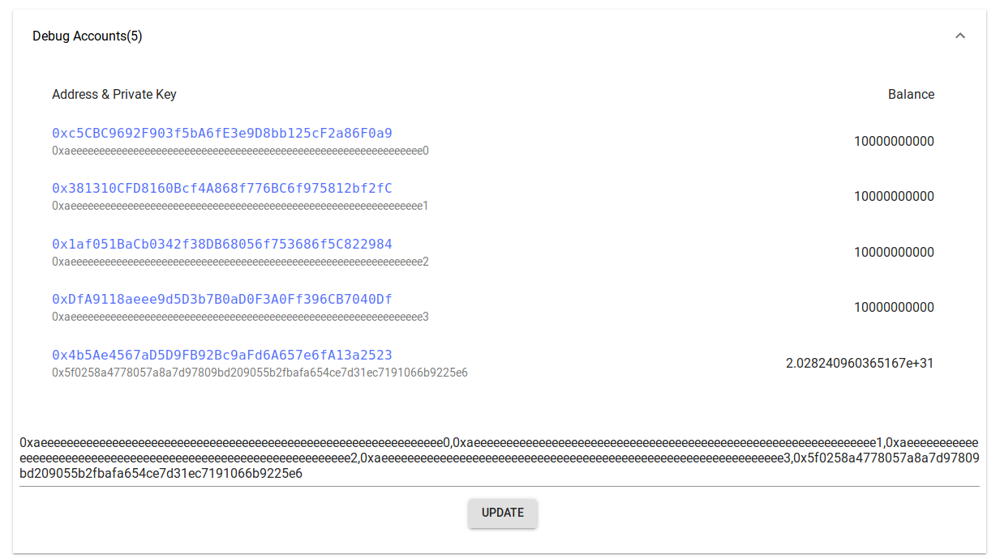

# Nervos AppChain OneClick

Nervos AppChain OneClick is based on Nervos AppChain tool chain. It combines almost all the Nervos AppChain development necessities,  including [CITA](https://github.com/cryptape/cita), [Microscope](https://github.com/cryptape/microscope) and [ReBirth](https://github.com/cryptape/re-birth), into one package. Developers who want to quickly start Nervos AppChain to have an overview or want to perform an agile prototype development only need to enter a few command lines.

## Components Support

- CITA: v0.19
- Microscope: `develop:a7a2bde`
- ReBirth: `master:073d982`

## Disclaimer

appchain-oneclick is just a developing tool now, do not take it as an official chain.

## Quick Start

Nervos AppChain OneClick has two different packages. Full version includes ReBirth and light version doesn't.

### Requirements

- [Docker](https://docs.docker.com/install/) 17.05 or higher
- [Docker Compose](https://docs.docker.com/compose/install/)

### OneClick Full

#### 1. Get the Repo

```bash
git clone https://github.com/PRIEWIENV/appchain-oneclick.git --recursive
cd appchain-oneclick
```

#### 2. Configure

```bash
./configure.sh
```

#### 3. Build the docker compose

Run once when first use.

```bash
docker-compose build
docker-compose run --rm app bundle exec rake db:setup
```

ReBirth database will be stored into the directory `docker/data`. This folder is root-privileged due to ReBirth itself. You don't need to run `docker-compose run --rm app bundle exec rake db:setup` again if this folder is not damaged.

#### 4. Start docker compose

```bash
docker-compose up
```

#### 5. Exposed port

- CITA: http://localhost:1337/
- ReBirth: http://localhost:8888/
- Microscope: http://localhost:8080/

#### Stop and Restart

* Stop docker compose gracefully

Just press <kbd>Ctrl</kbd> + <kbd>C</kbd> once.

* Restart

```bash
docker-compose up
```

* Clean all the data

```bash
rm -rf cita/cita_secp256k1_sha3/test-chain
rm -rf docker
docker-compose down
```

* Rebuild all the docker images

```bash
docker compose build --no-cache
```

### OneClick Light

Please refer to the [develop branch](https://github.com/PRIEWIENV/appchain-oneclick/tree/develop)

## Features

### Debug mode of Microscope


### Default accounts with initial value


